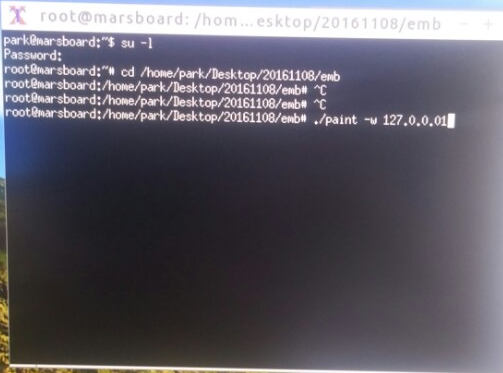
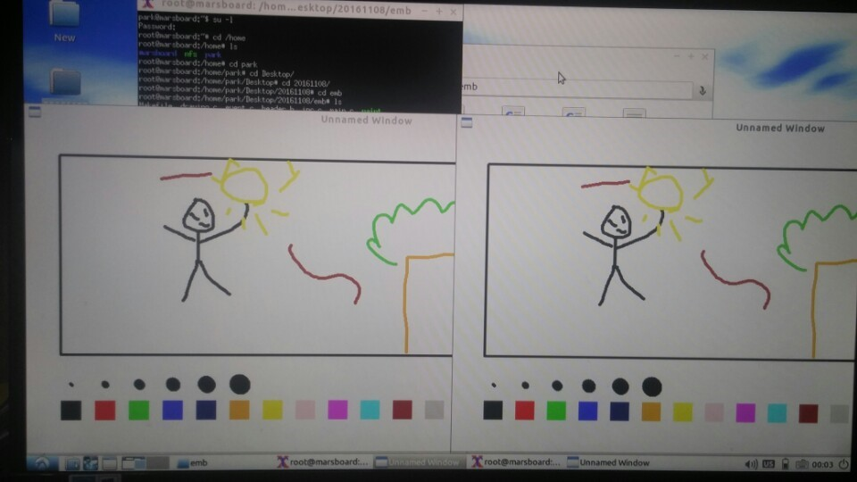

# Pictionary-on-Linux

## 개요
- 2016학년도 3학년 2학기 '임베디드 시스템' 수업 과제
- POSIX API와 표준 C 라이브러리를 이용하여 Linux 데스크탑 환경에서 실행하는 프로그램 작성
- 다수의 스레드와 프로세스로 구성하고, 별도의 머신에서 실행중인 프로세스가 소켓 통신을 이용하여 진행상황을 모니터링할 수 있어야 한다
- 실시간으로 그림 내용이 공유되는 그림판 프로그램 구현 (forked from [Pictionary-on-Unix](https://github.com/NaniteFactory/Pictionary-on-Unix))

## 실행화면

